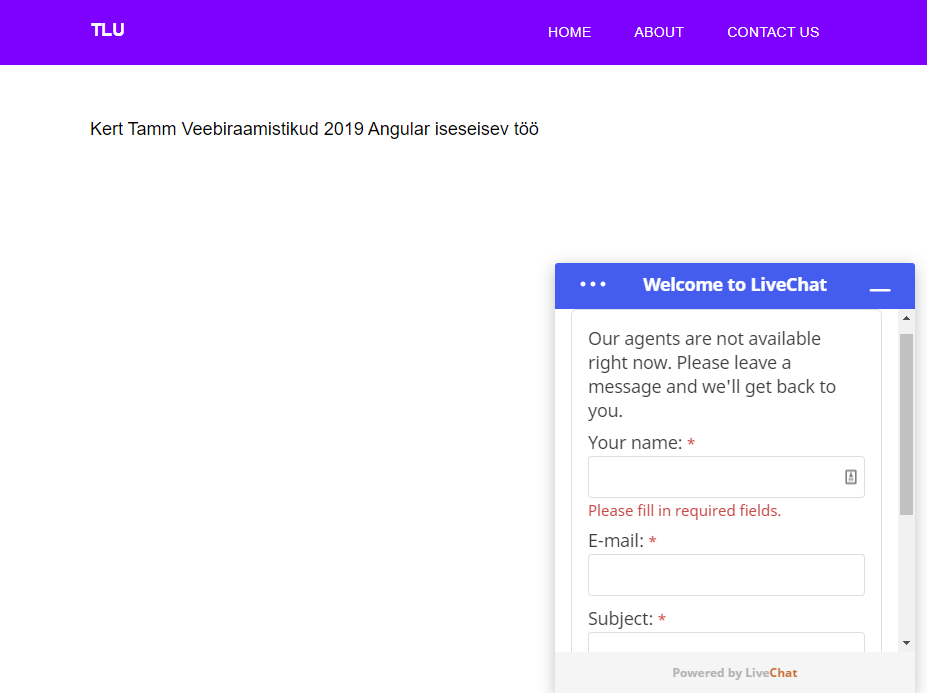
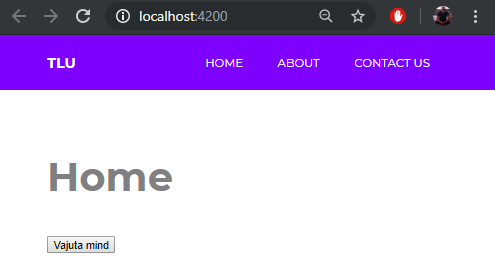

# Kert Tamm Angular Iseseisev Töö

This project was generated with [Angular CLI](https://github.com/angular/angular-cli) version 8.3.3.

## Development server

Run `ng serve` for a dev server. Navigate to `http://localhost:4200/`. The app will automatically reload if you change any of the source files.

## Code scaffolding

Run `ng generate component component-name` to generate a new component. You can also use `ng generate directive|pipe|service|class|guard|interface|enum|module`.

## Build

Run `ng build` to build the project. The build artifacts will be stored in the `dist/` directory. Use the `--prod` flag for a production build.

## Running unit tests

Run `ng test` to execute the unit tests via [Karma](https://karma-runner.github.io).

## Running end-to-end tests

Run `ng e2e` to execute the end-to-end tests via [Protractor](http://www.protractortest.org/).

## Further help

To get more help on the Angular CLI use `ng help` or go check out the [Angular CLI README](https://github.com/angular/angular-cli/blob/master/README.md).

# Angular - Kert Tamm 1.tunnitöö

GITHUB demo link: https://github.com/egertpiksar/Angular

installida kõige viimasem node.js versioon: https://nodejs.org/en/

**npm install -g @angular/cli**

**npm install --save-dev @angular-devkit/build-angular

**ng new minuapp**

stylesheetiks sai valitud CSS

tuleb minna vastavasse kausta kuhu angular app sai paigaldatud

**cd minuapp**

**ng serve --open**

kui kõik on õigesti tehtud siis peaks compilimise lõpuks avanema leht automaatselt aadressiga http://localhost:4200/

**NB! enne githubi üleslaadimist lisada .gitignore faili vastavad angular gitignore’d et ei laetaks üles paarsada mb angulari enda faile**
